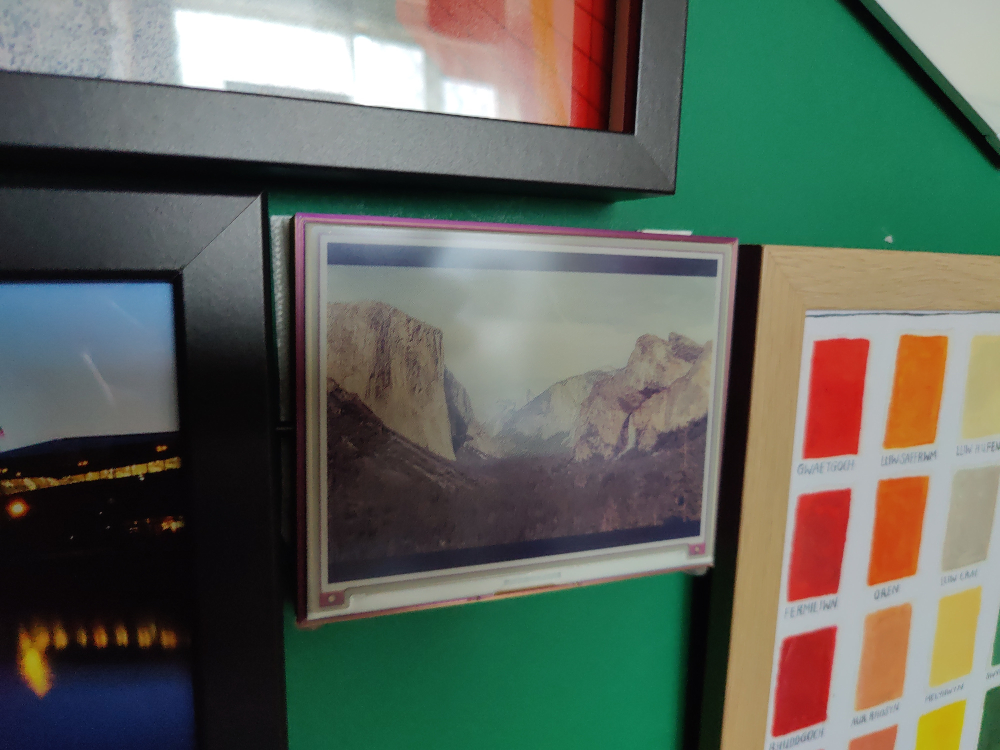

Inky-Display
===

a smol daemon for periodically fetching and rendering images to a pimoroni inky display

## Avalible Plugins

* wikimedia picture of the day
* url
  * mainly for use with home assisntant and the e-ink addon that exists

  
18+ Plugins

  * e621
  * stash
    * gallery
    * performer
    * scenes
  

## todo

- [x] remove hardcoded resolution so that other pimorni displays can be used
- [ ] document the configuration
- [ ] add support for buttons now that `inky` uses gpiod
- [x] use logger instead of many prints